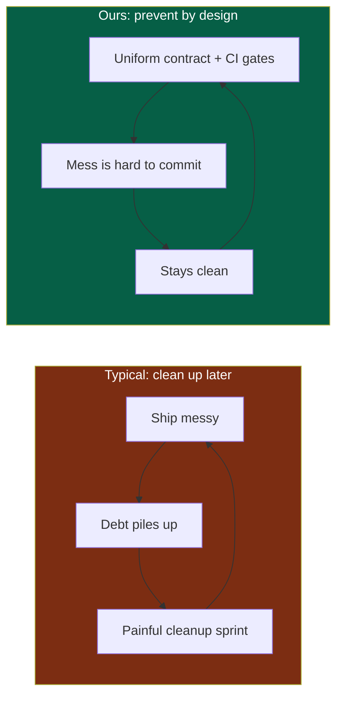
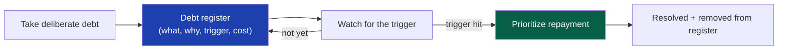

# 51 — Technical Debt Prevention

> **Status:** Draft v1 · **Owner:** CTO / Principal Engineer · **Audience:** Everyone who writes, reviews, or generates code — human or AI
> **Governed by:** `00`–`50`. This chapter defines what technical debt is, how our architecture *structurally prevents* it from accumulating, and how we track and repay the debt we deliberately take on. Prevention is the theme of the whole constitution; this chapter names it explicitly.

---

## 1. What Technical Debt Actually Is

**Technical debt** is the future cost created by choosing an easy-now solution over a correct-now one. Like financial debt, a little can be a smart, deliberate tool — but unmanaged, compounding debt eventually consumes all your capacity just servicing the interest (fixing symptoms, working around messes) with nothing left to build.

**Simple explanation:** imagine a kitchen where, to cook dinner faster, you never wash up — you just push dirty dishes aside. The first night it saves ten minutes. By the end of the week there's nowhere to work, you can't find anything, and cooking a simple meal takes an hour of shuffling mess. That accumulated mess is technical debt: each shortcut felt free, but together they made everything slow. Our goal is a kitchen that stays clean *by design*, so we can keep cooking fast for ten years.

> **CTO note:** the dangerous misconception is that all debt is bad. It isn't — *deliberate, tracked* debt (ship a simpler version now, improve it when it matters) is a legitimate strategy, and for a solo founder racing to revenue it's often *correct* (`00`, KISS/YAGNI). What's fatal is *accidental, invisible* debt — messes created without noticing, never tracked, compounding silently. This chapter is about preventing the accidental kind and managing the deliberate kind. The enemy is not debt; it's *unmanaged* debt.

---

## 2. Our Core Insight: Prevent Structurally, Don't Clean Up Heroically

Most teams fight debt reactively — periodic "cleanup sprints" that never quite happen. We take a fundamentally different stance, straight from the constitution: **make the clean path the easy path, so debt is hard to create in the first place.**

**Simple explanation:** instead of letting mess build and then heroically cleaning it (which never scales and always slips), we build the system so that making a mess is *harder than doing it right*. The plugin contract, the type system, and the CI gates act like a kitchen where the dishwasher is right next to the sink and the counter physically won't hold dirty dishes — cleanliness isn't discipline, it's the path of least resistance.

---

## 3. How the Architecture Structurally Prevents Debt

Nearly every major decision in this constitution is, viewed from one angle, a debt-prevention mechanism. Here's the map.

| Architectural decision | Debt it prevents | Chapter |
|------------------------|------------------|---------|
| **Uniform plugin contract** | 1,000 divergent snowflake pages that each rot differently | `13` |
| **Contract as a TypeScript type** | "Works but slightly wrong" tools that break silently | `13` |
| **CI quality gates** | Untested, inaccessible, slow, insecure code merging | `40` |
| **Strict TypeScript, `any` banned** | Type-unsafe code that crashes in production | `08` |
| **Pure, framework-free logic** | Business logic entangled with frameworks (rewrite risk) | `04`, `08` |
| **Replaceable interfaces** | Vendor lock-in that forces rewrites | `00`, `11` |
| **Docs change with code** | Documentation drift (`50`) | `50` |
| **One canonical name** | Naming chaos that makes everything unsearchable | `09` |
| **Codemods for contract changes** | Manual 1,000-file migrations | `13`, `49` |

**Simple explanation:** look at that list — every item is a decision we already made for *other* reasons (quality, scale, SEO), and every one *also* prevents a specific kind of debt. That's not a coincidence. A well-designed architecture is largely a *debt-prevention machine*: it makes the right thing automatic and the wrong thing difficult. We don't have a separate "anti-debt" system; the whole platform *is* one.

> **CTO note:** the deepest anti-debt weapon we have is **uniformity** (`00`, §6.2). Debt thrives on variation — when every tool is slightly different, each accumulates its own unique cruft, and there's no leverage to fix them together. When every tool is identical in shape, a fix or improvement applies to *all* of them via one codemod (`49`). Consistency isn't just aesthetic; it's what keeps the *marginal* maintenance cost of tool #1000 the same as tool #1. That flat maintenance curve is the whole ballgame for a small team.

---

## 4. The Anti-Patterns We Structurally Block

Certain moves create debt fast. Our system is designed to make them difficult or impossible.

| Anti-pattern | Why it's debt | How we block it |
|--------------|---------------|-----------------|
| **Copy-paste a tool** to make a new one | Creates a divergent snowflake; fixes don't propagate | `pnpm new-tool` from `_template/` is easier than copying (`06`) |
| **Cross-tool imports** | Coupling; you can't change one without breaking another | Lint rule forbids it (`08`); pnpm isolation errors (`05`) |
| **Skipping tests** | Untested code becomes untouchable | CI blocks merge without passing tests (`39`, `40`) |
| **Hardcoding what should be config** | Every change needs code edits forever | Config-over-hardcoding (`00`) + review |
| **Framework code in logic** | Framework change = rewrite | Lint/architecture boundaries (`05`, `08`) |
| **Silent `any` / type escapes** | Hidden runtime bombs | ESLint bans `any`; escapes require commented justification (`08`) |
| **Undocumented decisions** | Future "fixes" that undo deliberate choices | ADRs (`50`) |

**Simple explanation:** each row is a common shortcut that feels fast but plants debt. For each, we've arranged things so the shortcut is *blocked or harder than the right way*. You can't easily copy-paste a tool because scaffolding a proper one is one command. You can't import another tool's guts because the linter and package manager refuse. You can't merge without tests. The mess-making moves are the ones that meet resistance.

---

## 5. Deliberate Debt: When Shortcuts Are Correct

Not all debt is bad — sometimes shipping a simpler version now is the *right* call (`00`, KISS/YAGNI). The rule is that such debt must be **deliberate, visible, and tracked** — never accidental.

### The deliberate-debt protocol
1. **Decide consciously:** "We're doing the simple version now because X; the fuller version waits for Y."
2. **Record it:** a `TODO(owner): reason + trigger` in code, and/or an entry in the debt register (§6), and/or an ADR if it's architectural.
3. **Define the trigger:** *what* future condition means it's time to pay this back (e.g., "when a tool needs server compute," "when we exceed 100 tools").
4. **Never let it go silent:** tracked debt is fine; forgotten debt is the danger.

**Simple explanation:** it's completely okay to say "I'll build the quick version of this now and improve it later" — as long as you write down that you did, why, and what will tell you it's time to come back. The difference between healthy and toxic debt isn't the shortcut itself; it's whether you *tracked* it. An IOU you wrote down and scheduled is fine. An IOU you forgot you owe is how you go bankrupt.

> **CTO note:** for you specifically — a solo founder racing to revenue — taking deliberate debt is not just allowed, it's *necessary*. Perfectionism before product-market fit is its own kind of debt (opportunity cost). The whole phased architecture (`04`) is essentially a giant, deliberate, *tracked* debt: "we're not building the backend/DB/auth yet, and here's exactly the trigger for each." That's debt done right — conscious, visible, with a defined payback condition. The discipline isn't "never take shortcuts"; it's "never take *untracked* shortcuts."

---

## 6. Tracking and Repaying Debt

The debt we do take on lives in a visible register, not in people's memories.

| Practice | Detail |
|----------|--------|
| **Debt register** | A tracked list (issues labeled `tech-debt`, or a doc) of known, deliberate debt |
| **Each item has a trigger** | The condition that promotes it from "fine for now" to "pay now" |
| **Regular review** | Periodically scan the register against current reality |
| **Repayment is real work** | Paying debt is planned work, not "if we have time" |
| **Debt from AI-generated code** | Extra scrutiny — AI can produce plausible-but-suboptimal code that hides debt |

**Simple explanation:** every deliberate shortcut goes on a list with a note: what it is, why we did it, and what will signal it's time to fix. We check the list periodically. When a trigger fires (say, a tool finally needs a server, activating a deferred piece), paying that debt becomes real planned work — not something squeezed into leftover time, because leftover time never exists. The register turns "we'll get to it" into "here's exactly what we owe and when it comes due."

> **CTO note — watch AI-generated debt especially.** AI produces code that *looks* clean and *passes tests* but may embed subtle debt: a slightly-off abstraction, a missed edge case, an inefficient approach. Because it's plausible, it slips through review more easily than obviously-bad human code. So AI-generated tools get scrutiny specifically for *conceptual* quality, not just "does it run" (`35`). This is the same lesson as the correctness checkpoint in `35`/`07` — automated success is not the same as actually being right.

---

## 7. The Refactoring Cadence

Even with structural prevention, some refactoring is healthy — but we keep it small and continuous, not big and rare.

| Principle | Why |
|-----------|-----|
| **Refactor continuously, in small steps** | Big-bang rewrites are high-risk and usually unnecessary |
| **Boy-scout rule** | Leave code slightly better than you found it, opportunistically |
| **Refactor behind tests** | The test suite (`39`) makes refactoring safe |
| **Refactor with evidence, not taste** | Change structure for a real reason (a pending feature, measured pain), not aesthetics |

**Simple explanation:** we improve the codebase in small, safe, continuous nudges rather than dramatic overhauls. When you're already in a file for another reason, tidy it a little. Big rewrites are dangerous and rarely needed if you've been keeping things clean all along. And we only restructure when there's a *real reason* (an upcoming feature, a measured slowdown) — never just because a different shape would be prettier (that's gold-plating, `00`).

---

## 8. Summary

- Technical debt is the **future cost of easy-now over correct-now**; a little deliberate debt is a smart tool, but unmanaged compounding debt eventually consumes all capacity in maintenance.
- Our core stance is **structural prevention, not heroic cleanup**: make the clean path the *easy* path, so debt is hard to create — the whole architecture is, viewed one way, a debt-prevention machine.
- **Uniformity is the deepest anti-debt weapon** — identical tool shapes keep the marginal maintenance cost of tool #1000 equal to tool #1, and let one codemod improve all tools at once.
- We **structurally block the fast debt-makers** (copy-paste tools, cross-tool imports, skipped tests, hardcoding, framework-in-logic, silent `any`) by making the right way easier than the shortcut.
- **Deliberate debt is legitimate and often necessary** for a solo founder racing to revenue — the phased architecture *is* tracked debt — but it must be **conscious, visible, and triggered**, never silent. The enemy is untracked debt, not debt itself.
- Debt lives in a **register with triggers**, reviewed regularly; repayment is **real planned work**; and **AI-generated debt gets extra scrutiny** because plausible-looking code hides debt that passes tests.
- **Refactoring is continuous and small, done behind tests and with evidence** — never big-bang rewrites or aesthetic churn.

> Next: `52-FUTURE-ROADMAP.md` — the final chapter: the phased plan recapped, every deferred item with its activation trigger, and the 10-year path back to the vision.

---

### Changelog
| Version | Date | Change | Reason |
|---------|------|--------|--------|
| v1 | (draft) | Initial technical-debt-prevention strategy | Project inception |
