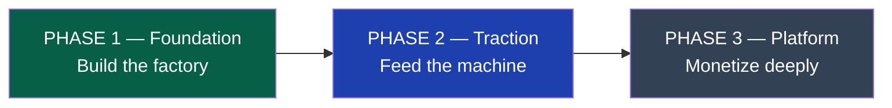
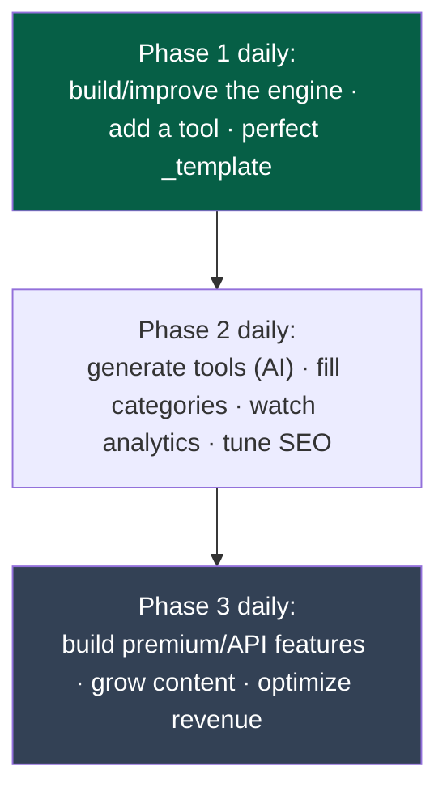

# 52 — Future Roadmap

> **Status:** Draft v1 · **Owner:** CTO / Founder · **Audience:** Everyone — this is where the whole constitution converges into a sequenced plan
> **Governed by:** `00`–`51`. This is the final chapter. It recaps the phased build, maps milestones to features, lists every deferred item with its concrete activation trigger, and ties the 10-year path back to the vision (`01`).

---

## 1. Purpose of This Chapter

Every prior chapter answered "how do we build *X* correctly?" This one answers "in what *order*, and *when* do we build each thing?" It's the sequencing layer that turns 52 chapters of principles into a day-by-day-buildable plan — critically important for a solo founder who needs to know, each morning, *what to build next and what to deliberately ignore*.

**Simple explanation:** the other chapters are the full cookbook — every recipe done right. This chapter is the *menu plan for the year*: which dishes to cook first, which ingredients to buy later, and which fancy dishes to skip until the restaurant is actually busy. Without it, you'd be tempted to cook everything at once and burn out before the first customer arrives.

> **CTO note:** the roadmap's most important job is protecting you from *your own ambition*. The vision is huge (1,000+ tools, APIs, enterprise, mobile, multi-language). Trying to build toward all of it at once is the surest way to build none of it. This roadmap is a commitment device: build the current phase's load-bearing walls, deliberately defer the furniture, and don't skip ahead. Discipline in sequencing is what gets a solo founder to revenue.

---

## 2. The Three Phases (Recap)

The entire architecture is organized around three phases (`04`, `11`, `12`). This is the backbone of the roadmap.

| Phase | Goal | Build | Deliberately DON'T build |
|-------|------|-------|--------------------------|
| **1 — Foundation** | A working tool factory | Next.js + plugin engine + SEO engine + client-side tools + Cloudflare | Database, backend service, auth, API, search service |
| **2 — Traction** | Scale tools + measure | Postgres/Redis, Meilisearch, observability, isolated server-tools, analytics | Auth, premium, public API |
| **3 — Platform** | Deep monetization | Auth, premium, billing, public/white-label API, NestJS | Enterprise unless a customer pulls it |

**Simple explanation:** Phase 1 builds the *machine that makes tools* — not 1,000 tools, the machine. Phase 2 runs that machine to produce lots of tools while adding the systems to store data and measure what's working. Phase 3 turns the audience into serious revenue with accounts, premium, and the API business. Each phase has a clear "not yet" list so we don't over-build.

---

## 3. Milestones Mapped to Features

From `01`, the milestones M1–M5 mark real progress. Here's what gets built and proven at each.

| Milestone | Product state | Key features built | The proof it's real |
|-----------|---------------|--------------------|--------------------|
| **M1 — Foundation** | 20–50 tools | Plugin engine, SEO engine, `_template/`, first tools, AdSense | Add one folder → fully-optimized, indexed tool (`01`, mechanical test) |
| **M2 — Traction** | 200–500 tools | AI tool generation (`35`), search, observability, more categories | AI generates a passing tool; approaching Mediavine traffic bar |
| **M3 — Scale** | 1,000+ tools; i18n | Postgres, premium, multi-language, content clusters | 2–5M monthly visitors; premium live |
| **M4 — Platform** | Public + white-label API; mobile | NestJS, metered API, mobile app reusing pure logic | API revenue; enterprise pilots |
| **M5 — Leader** | Utility layer habit | AI long-tail generation at low cost; ecosystem | Diversified revenue; defensible moat |

**Simple explanation:** these milestones are honest checkpoints tied to *evidence*, not vibes. M1 isn't "the site looks nice" — it's the mechanical proof that adding a folder produces a complete tool. M3 isn't "we have lots of tools" — it's real traffic (2–5M visitors) and live premium. Each milestone has a concrete test you can point at and say "yes, we're actually here."

---

## 4. The Deferred-Items Register (With Triggers)

This is the heart of the roadmap: every major thing we're *deliberately not building yet*, and the precise condition that says "now build it." This is the tracked, deliberate debt from `51` — visible, not forgotten.

| Deferred item | Phase | Activation trigger | Chapter |
|---------------|-------|--------------------|---------|
| **PostgreSQL + Prisma** | 2 | First real need to persist state (metering, saved data) | `12` |
| **Redis** | 2 | Caching hot reads / rate-limiting becomes necessary | `21` |
| **Meilisearch** | 2 | Static search index outgrows its usefulness (catalog/query volume) | `32` |
| **Full observability stack** | 2 | Traffic large enough that "is it working?" needs dashboards | `28`–`30` |
| **Server-side tools** | 2 | A genuinely valuable tool can't run client-side (OCR, etc.) — cost-modeled first | `11` |
| **AI tool generation pipeline** | 2 | Tool creation volume justifies automating it | `35` |
| **Authentication / accounts** | 3 | Building premium or any logged-in feature | `23` |
| **Premium / billing** | 3 | Enough traffic that 1–2% conversion is meaningful + premium-worthy features exist | `24`, `03` |
| **Public API** | 3 | Tool library broad + stable; developer demand evidenced | `22` |
| **NestJS backend service** | 3 | Real server-side domains (accounts, billing, API, jobs) accumulate | `11` |
| **White-label API** | 3+ | A paying customer pulls it | `22` |
| **Localization (i18n)** | 3 | Core tool set proven; translation ROI positive | `36` |
| **Native mobile apps** | 3+ | Mobile web excellent + traffic justifies native | `38` |
| **Enterprise features** | 4+ | A concrete paying enterprise customer requires them | `03` |

**Simple explanation:** this table is your "not yet" list with alarms attached. Each deferred thing has a specific signal — a trigger — that tells you when to stop ignoring it and build it. You don't build the database on a calendar date; you build it the moment you have real data to store. You don't build accounts until you're building something people log into. This keeps you from both *over-building* (building too early) and *forgetting* (never building something you'll need). It's the whole "build the seam, defer the feature" philosophy made into a checklist.

> **CTO note:** revisit this register regularly (`51`, §6). The triggers are how deferred work re-enters the plan at the right moment — not too early (wasting your pre-revenue time), not too late (blocking growth). If you ever feel the urge to build something on this list "because it'd be cool," check whether its trigger has fired. If not, the honest answer is "not yet, and here's exactly what I'm waiting for." That sentence is one of the most valuable a founder can say.

---

## 5. The Daily Build Loop Across Phases

Zooming from years down to a single day — because you build daily (`07`), here's what "the work" actually looks like in each phase.

**Simple explanation:** in Phase 1, your daily work is mostly *building the machine* and adding the first tools by hand to prove it works. In Phase 2, the machine works, so your day shifts to *producing tools at volume* (increasingly AI-assisted) and watching the data to see what's ranking and earning. In Phase 3, the audience is big, so your day shifts again to *building the money features* (premium, API) and optimizing revenue. Same daily rhythm; the *nature* of the work evolves as the platform matures.

---

## 6. Decision & Revisit Points

A 10-year plan can't be fixed in stone. These are the moments we deliberately step back and re-evaluate.

| Revisit point | Question to ask |
|---------------|-----------------|
| **End of each phase** | Did we hit the milestone's proof? What did we learn? |
| **When a deferred trigger fires** | Is the target design in the relevant chapter still right? |
| **Ad-network thresholds (50k, 100k sessions)** | Time to climb the ad ladder (`19`, `03`)? |
| **Any architectural surprise** | Does this contradict a locked decision? Write an ADR (`50`) |
| **Periodic constitution review** | Have the docs drifted from reality (`50`)? |

**Simple explanation:** we don't blindly follow the plan off a cliff. At the end of each phase, when a trigger fires, and at key traffic thresholds, we pause and ask "is this still the right call given what we now know?" The plan is a strong default, not a straitjacket — and when we change course, we record *why* (an ADR, `50`) so the reasoning survives.

---

## 7. What Success Looks Like at Year 10

Tying the whole roadmap back to the vision (`01`):

- **Product:** UToolios is the reflexive place people and machines go for a small computation — the "utility layer of the web."
- **Scale:** thousands of tools, millions of ranking pages, millions of monthly visitors and API calls, multiple languages.
- **Engineering:** still running on this architecture — no rewrite — because the load-bearing walls (plugin contract, framework-free logic, replaceable vendors, SEO structure) were built right from day one.
- **Business:** diversified, resilient revenue (ads + premium + API + sponsored), with a compounding SEO/content flywheel and a low, flat cost structure as the moat.
- **Team:** whatever its size, it moves fast because the platform's uniformity and documentation let humans and AI contribute reliably.

**Simple explanation:** ten years out, the bet pays off not because of one brilliant tool, but because we built a *factory and a flywheel* and ran them patiently. The architecture we're documenting now is what lets that decade happen without a costly rewrite in the middle — the whole point of writing this constitution before writing code.

> **CTO note — the final word.** The single biggest risk to this entire plan is not technical; it's *impatience*. The architecture is sound, the market is real, the economics work. What kills platforms like this is either over-building before revenue (burning the runway on furniture) or under-building the foundations (cutting a load-bearing wall to ship faster). This constitution exists to hold the line on both: build the walls right, defer the furniture honestly, and show up daily. Do that, and the compounding does the rest. Correct, not quick — all the way down.

---

## 8. Summary

- The roadmap **sequences** the 52 chapters into a buildable order, protecting a solo founder from the fatal temptation to build everything at once.
- Three phases: **Foundation** (build the tool factory), **Traction** (run it + measure), **Platform** (monetize deeply) — each with an explicit "don't build yet" list.
- **Milestones M1–M5** are tied to *evidence*, not vibes — M1's proof is the mechanical "one folder → complete tool" test; M3's is real traffic + live premium.
- The **deferred-items register with triggers** is the core artifact: every major deferred capability (DB, search, auth, premium, API, NestJS, i18n, mobile, enterprise) has a precise activation signal — the "build the seam, defer the feature" philosophy as a living checklist.
- The **daily build loop evolves by phase** — building the machine, then producing tools at volume, then building revenue features — while the daily rhythm stays constant.
- We **revisit at phase boundaries, trigger events, and traffic thresholds**, recording course changes as ADRs — the plan is a strong default, not a straitjacket.
- **Year-10 success** is a factory + flywheel run patiently on an un-rewritten architecture — and the biggest risk is *impatience*, in either direction. Correct, not quick.

> This is the final chapter of the founding engineering constitution. Every future decision should trace back to these documents — and when reality teaches us something new, we amend them deliberately (`00`, §8; `50`).

---

### Changelog
| Version | Date | Change | Reason |
|---------|------|--------|--------|
| v1 | (draft) | Initial future roadmap | Project inception |
