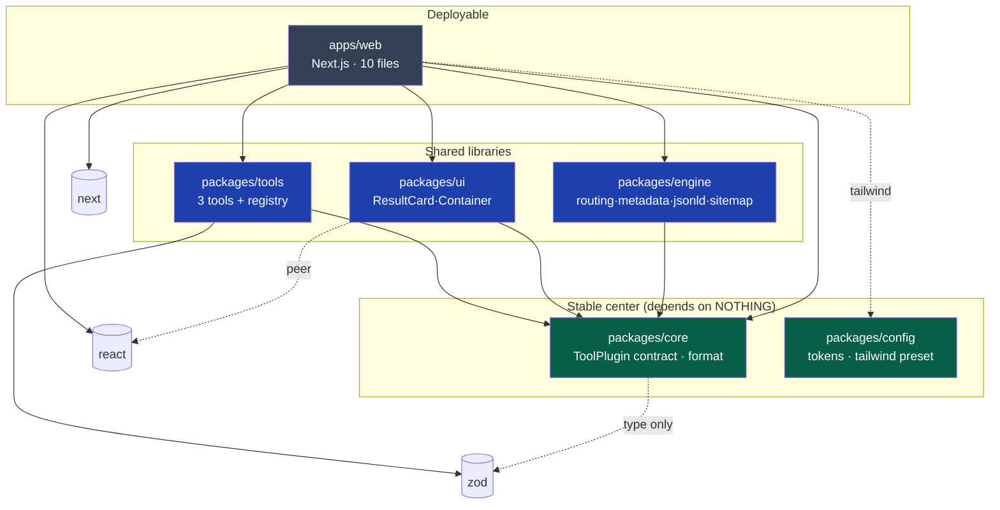
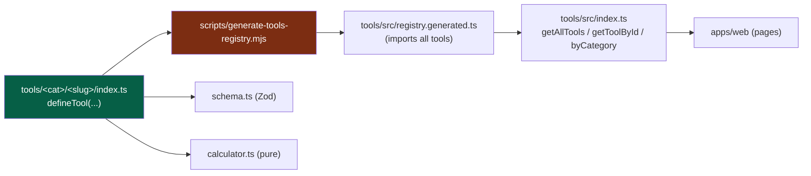
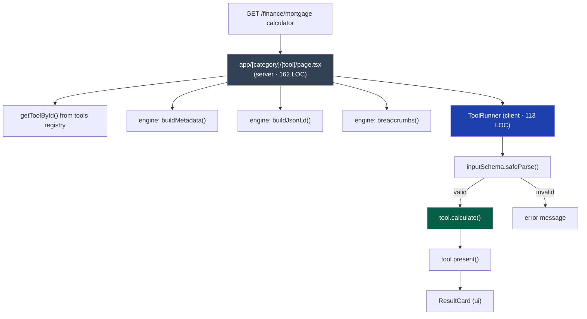
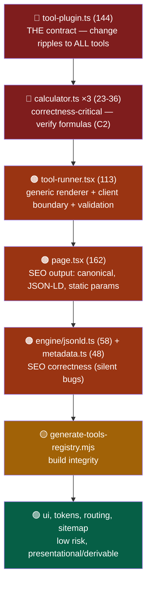
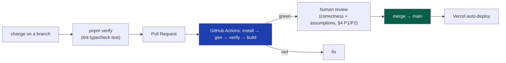

# CODE-REVIEW-GRAPH — UToolios

> **Status:** v1 (generated from the actual codebase, not from memory) · **Owner:** CTO
> **Purpose:** A reviewer's map — what depends on what, how data flows, and where to focus review effort. Use it to review the code (human or AI) and to onboard. Regenerate when structure changes.
> **Verified facts (2026-07-22):** `packages/core` imports nothing internal ✓ · no circular/upward deps ✓ · no `@/` app-alias leaking into packages ✓ · dependency direction is acyclic and points inward to `core`.

---

## 1. Package dependency graph (verified edges)

Every arrow was extracted from real `@utoolios/*` imports. Direction points **inward to `core`** (Clean Architecture, `04`/`05`). No cycles.

**Review check per edge:** no library depends on `apps/web`; `core` stays framework-free (only a *type-only* `zod` import); `engine` never imports `tools` (it operates on `ToolPlugin` passed in). All hold. ✓

---

## 2. Registration data-flow (how a folder becomes a live tool)

**Review focus:** the generator (`G`) is build-critical — if it breaks, nothing registers (it recently had a stray-token bug). `registry.generated.ts` is committed and must never be hand-edited.

---

## 3. Render data-flow (one tool page request)

**Review focus:** `page.tsx` emits SEO (canonical, JSON-LD) — silent-catastrophic if wrong (`14`). `ToolRunner` is the generic renderer + the client boundary — review validation and edge cases here.

---

## 4. Review-priority heat map (where to look, and why)

Ranked by blast-radius × correctness-sensitivity. Grounded in real LOC.

| Priority | Module | What to scrutinize |
|----------|--------|--------------------|
| 🔴 P1 | `core/tool-plugin.ts` | Contract changes; every field is a promise to 1000+ tools. Additive-only unless codemod (`49`). |
| 🔴 P2 | `tools/*/calculator.ts` | **Formula correctness** vs known values. Tests exist (6) — confirm they assert real-world-correct numbers, not just self-consistent ones (`35` caveat). |
| 🟠 P3 | `web/components/tool-runner.tsx` | Input coercion, `safeParse` handling, empty/NaN edge cases, `'use client'` bundle scope. |
| 🟠 P4 | `web/app/[category]/[tool]/page.tsx` | Canonical URL, JSON-LD shape, `generateStaticParams`, `notFound()` path. |
| 🟠 P5 | `engine/jsonld.ts`, `metadata.ts` | Only markup for on-page content; title/description limits; no fabricated data. |
| 🟡 P6 | `scripts/generate-tools-registry.mjs` | Runs before build; scans folders; committed output. |
| 🟢 P7 | `ui/*`, `config/*`, `engine/routing.ts`, `sitemap.ts` | Derivable/presentational — lowest risk. |

---

## 5. Code-review process graph (the gates)

**Note:** branch protection is not enforced (GitHub free + private repo). CI still runs and reports; the human gate at §4 (P1/P2) is the real quality backstop — automation can't verify a formula is *conceptually* right (`35`).

---

## 6. Review checklist (per PR)

- [ ] Dependency direction preserved — no new edge points away from `core`; `core` stays framework-free (§1).
- [ ] New tool = one folder + `pnpm gen`; no platform file hand-edited (M1 invariant, `13`).
- [ ] Formula correctness verified against a **known real-world value**, not just a passing self-referential test (§4 P2, `35`).
- [ ] SEO output intact: canonical, JSON-LD, metadata (§4 P4/P5, `14`).
- [ ] No fabricated data (ratings/usage/counts) — real registry data only (`DESIGN-SPEC` §0).
- [ ] `pnpm verify` + `pnpm --filter @utoolios/web build` green (evidence pasted).
- [ ] Accessibility: labels, focus, `aria-live` on results (`37`).

---

### Changelog
| Version | Date | Change | Reason |
|---------|------|--------|--------|
| v1 | (draft) | Initial code review graph generated from the live codebase | Requested; aids review + Sonnet handoff |
